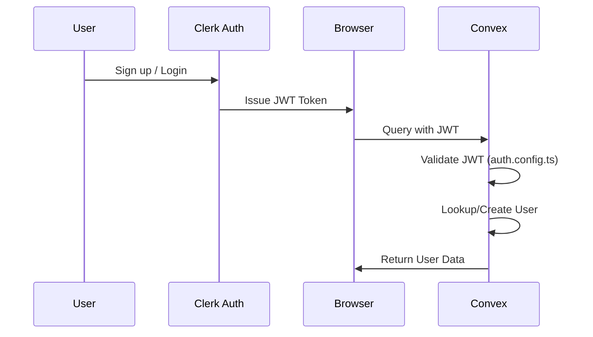
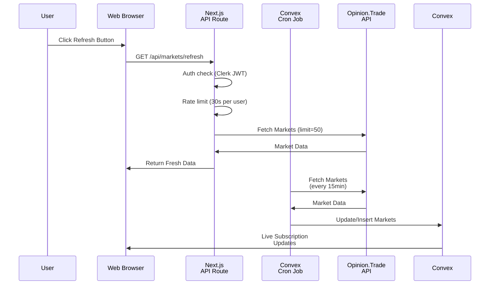
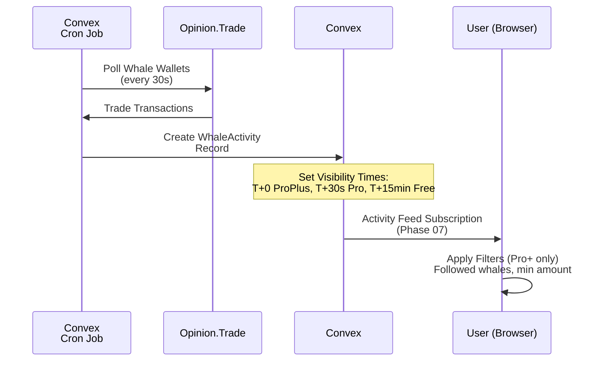
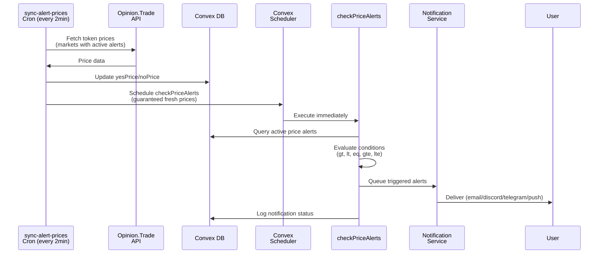
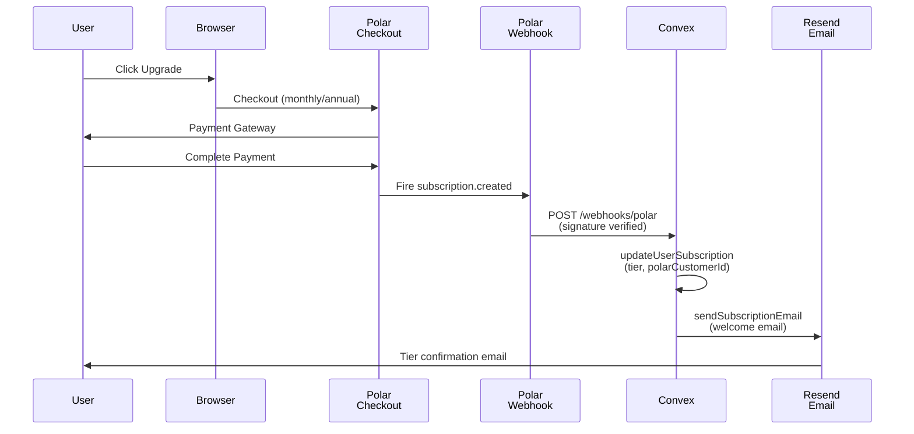

# OpinionScope System Architecture

Comprehensive system design, data flow, component interactions, and external integrations.

---

## System Overview

OpinionScope is a serverless prediction market intelligence platform built on a modern cloud-native stack.

```mermaid
graph TB
    Client["Web Browser<br/>(Next.js 16 + React 19)"]
    Clerk["Clerk<br/>(Authentication)"]
    Convex["Convex<br/>(Real-time DB +<br/>Cron Jobs)"]
    Polar["Polar<br/>(Payments)"]
    OpinionTrade["Opinion.Trade API<br/>(Market Data)"]

    Client -->|Login| Clerk
    Client -->|Queries/Mutations| Convex
    Clerk -->|JWT Verification| Convex
    Convex -->|Cron Jobs<br/>(Phase 2-3)| Convex
    Convex -->|Fetch Data| OpinionTrade
    Convex -->|Store Data| Convex
    Client -->|Checkout| Polar
    Polar -->|Webhook| Convex
```

---

## Data Flow Architecture

### 1. Authentication Flow



**Implementation:**
- User logs in via Clerk UI component
- Clerk JWT issued, stored in HTTP-only cookie
- Middleware validates token for protected routes
- Convex validates JWT issuer domain in `auth.config.ts`
- User document created in Convex `users` table

### 2. Real-time Market Data Flow



**Frontend Proxy (Phase 04):**
- New endpoint: `GET /api/markets/refresh` (Next.js API route)
- Clerk JWT authentication & per-user rate limiting (30s)
- Direct Opinion.Trade API fetch (limit=50 markets)
- Immediate fresh data delivery to frontend
- Frontend refresh button on Market Screener page

**Sync Cycle (Phase 2-3):**
- Convex cron job triggers every 15 minutes (auto-sync)
- Fetches all active markets from Opinion.Trade API
- Batch upserts to `markets` table (external ID deduplication)
- Clients subscribed to `listMarkets` query receive live updates
- Rate limit: 15 req/sec, batched to 1 call per cycle

### 3. Whale Activity Detection & Feed Delivery



**Tiered Visibility (Phase 07):**
- **Pro+** - Real-time visibility (T+0) + filters
- **Pro** - 30-second delay (T+30s), no filters
- **Free** - 15-minute delay (T+15min), no filters

Implementation via `whaleActivity` table visibility timestamps. Feed queries use `getFeed()` function with tier-aware delays and optional Pro+ filters (followedOnly, minAmount).

### 4. Alert Trigger Flow (Price Alerts - Phase 03)



**Chaining Guarantee:**
- Price sync completes → Scheduler immediately triggers alert evaluation
- Alerts always evaluated against freshest prices (within 2min max staleness)
- No risk of stale price comparisons

**Alert Types:**
- **Price** - Market price crosses threshold (gt, lt, eq, gte, lte) [Phase 03]
- **Whale** - Tracked whale wallet activity [Future]
- **Volume** - Market volume threshold [Future]
- **NewMarket** - New market matching filter criteria [Future]

### 5. Subscription & Payment Flow (Phase 09)



**Subscription Lifecycle:**
- **subscription.created** - New user tier upgrade
- **subscription.updated** - Tier change, renewal
- **subscription.canceled** - User cancels (keeps features until period ends)
- **subscription.revoked** - Immediate access revocation

**Tiers & Pricing:**
- **Free** - $0/month, basic screener, 15min feed delay
- **Pro** - $29/month ($290/year), 30s feed delay, 50 alerts
- **Pro+** - $99/month ($990/year), real-time feeds, unlimited alerts

**Email Notifications:**
- Welcome email on subscription.created
- Cancellation email on subscription.canceled (includes renewal date)
- Expiration email on subscription.revoked (downgrade notice)

---

## Component Architecture

### Frontend Layer (Next.js + React 19)

**App Structure:**
```
/                                  # Landing page (Phase 10)
├── page.tsx - Home with 8 sections
├── layout.tsx - Root layout with SEO metadata
└── components/landing/
    ├── hero-section.tsx - Hero with CTA
    ├── features-grid.tsx - 6 feature cards
    ├── how-it-works.tsx - Usage walkthrough
    ├── pricing-preview.tsx - Tier pricing cards
    ├── testimonials.tsx - Social proof
    ├── faq-section.tsx - FAQ accordion
    ├── cta-section.tsx - Final conversion CTA
    └── footer.tsx - Footer links

dashboard/
├── Pages with ProtectedRoute guard
├── Market Screener (Phase 05)
├── Whale Tracker (Phase 06)
├── Activity Feed (Phase 07)
├── Alert Management (Phase 08)
└── User Settings
```

**Component Categories:**

1. **Layout Components** (`src/components/layout/`)
   - Navbar - Top navigation bar
   - Sidebar - Left navigation sidebar
   - Footer - Bottom footer

2. **Landing Components** (`src/components/landing/`) - Phase 10
   - HeroSection - Hero banner, headline, CTA buttons, social proof stats
   - FeaturesGrid - 6 feature cards (screener, whale tracker, feed, alerts, analytics, export)
   - HowItWorks - Step-by-step usage walkthrough
   - PricingPreview - Pricing tiers (Free/Pro/Pro+) with features
   - Testimonials - User testimonials & social proof
   - FAQSection - FAQ accordion
   - CTASection - Final conversion call-to-action
   - Footer - Footer links & branding

3. **Feature Components** (`src/components/`)
   - **screener/** - Filter & display markets (Phase 05)
   - **whales/** - Whale stats & tracking (Phase 06)
   - **feed/** - Real-time activity stream with tiered delivery (Phase 07)
     - ActivityFeed - List container with loading/empty states
     - ActivityItem - Individual trade display
     - FeedFilters - Pro+ filter controls (followed whales, min amount)
     - FeedErrorBoundary - Error resilience wrapper
     - LiveIndicator - Real-time status badge
   - **alert-system/** - Alert creation & management (Phase 08)
   - **pricing/** - Subscription pricing & management (Phase 09)
     - PricingCards - Monthly/annual tier cards with checkout CTA
     - FeatureComparison - Tier feature comparison table
   - **billing/** - User subscription management (Phase 09)
     - SubscriptionCard - Current subscription status display
     - BillingHistory - Past transactions (future)

4. **UI Components** (`src/components/ui/`)
   - shadcn/ui primitives (Button, Card, Table, etc.)
   - Tier-locked feature indicators
   - Price change badges
   - Loading spinners

5. **Custom Hooks** (`src/lib/hooks/`)
   - `useConvexQuery()` - Convex subscription wrapper
   - `usePagination()` - Pagination logic
   - `usePolling()` - Polling utilities

### Backend Layer (Convex Functions)

**Query Functions:**
- `listMarkets()` - Filter markets with pagination
- `getWhaleActivity()` - Get tiered-visibility activity
- `listWhales()` - Top whales by metric
- `getActivityFeed()` - User activity stream
- `listAlerts()` - User alerts
- `getCustomerPortalInfo()` - User subscription data (Phase 09)

**Mutation Functions:**
- `createAlert()` - Create price/whale alert
- `updateAlert()` - Modify alert conditions
- `deleteAlert()` - Remove alert
- `savePreset()` - Save screener filter
- `followWhale()` - Add whale to watchlist
- `updateUserSubscription()` - Tier upgrade from webhook (Phase 09, internal)
- `markSubscriptionCanceled()` - Mark subscription for renewal (Phase 09, internal)
- `downgradeToFree()` - Revoke subscription access (Phase 09, internal)

**Internal Actions (Phase 09):**
- `sendSubscriptionEmail()` - Resend email via Resend API

**Authorization:**
- All queries/mutations use Clerk JWT context
- Private user data filtered by ID
- Tier checks at query time (Free/Pro/Pro+)

### Data Layer (Convex Database)

**8 Tables with 25 Indexes:**

| Table | Fields | Indexes |
|-------|--------|---------|
| **users** | clerkId, email, tier, polarCustomerId, etc. | 4 (clerkId, email, tier, polarCustomerId) |
| **whales** | address, winRate, totalVolume, lastActiveAt, followerCount, etc. | 5 (address, winRate, totalVolume, lastActiveAt, followerCount) |
| **markets** | externalId, platform, yesTokenId, noTokenId, yesPrice, noPrice, volume, category, endDate, etc. | 5 (externalId+platform, category, category+volume, volume, endDate) |
| **whaleActivity** | whaleId, marketId, action, timestamp, visibleToProPlusAt, visibleToProAt, visibleToFreeAt | 6 (timestamp, whaleId+timestamp, marketId+timestamp, visibleToProPlus, visibleToPro, visibleToFree) |
| **alerts** | userId, type, condition, isActive, marketId, whaleId | 5 (userId, userId+type, marketId, whaleId, isActive) |
| **savedPresets** | userId, name, filters, isDefault | 1 (userId) |
| **notificationLog** | userId, channel, status, sentAt, alertId | 3 (userId+sentAt, status, alertId) |
| **syncLogs** | type, status, startedAt, itemCount, error | 2 (type, status) |

**Key Field Additions (Phase 01):**
- **markets.yesTokenId** - Opinion.Trade token ID for "YES" outcome price lookups
- **markets.noTokenId** - Opinion.Trade token ID for "NO" outcome price lookups
- Optional fields used for platform-specific integrations (e.g., chain interactions)

---

## External Integrations

### 1. Opinion.Trade API

**Purpose:** Primary market data source

**Integration Points:**
- Convex cron job polls every 15 minutes (auto-sync, Phase 2-3)
- Frontend proxy endpoint (`/api/markets/refresh`) for on-demand refresh
- Fetches market listings, prices, whale activity
- Rate limit: 15 requests/second (batched to 1 call per cycle)
- Data stored in `markets` & `whaleActivity` tables

**Frontend Proxy Details (Phase 04):**
- Route: `GET /api/markets/refresh`
- Authentication: Clerk JWT via `auth()` helper
- Rate limiting: Per-user 30-second cooldown (in-memory map)
- Request: `GET {baseUrl}/market?limit=50` with API key header
- Response: Direct pass-through of Opinion.Trade market data
- Error handling: 401 (unauthorized), 429 (rate limited), 502 (API error), 500 (server error)

**Fallback:** Mock data during development (API key application can take 1-2 weeks)

### 2. Clerk Authentication

**Purpose:** User authentication & profile management

**Integration:**
- OAuth UI in web app
- JWT generation
- Profile sync to Convex `users` table
- Verified via `CLERK_JWT_ISSUER_DOMAIN` in Convex

**Fields Synced:**
- Email, name, avatar URL
- User ID (clerkId)

### 3. Polar Payments (Phase 09)

**Purpose:** Subscription billing & analytics

**Integration Points:**
- Checkout sessions created via `/api/checkout` endpoint
- Monthly/annual product IDs configured via env vars
- Webhooks at `POST /webhooks/polar` trigger user tier updates
- `polarCustomerId` & `polarSubscriptionId` stored in `users` table
- Tier access checked at query time for feature gating

**Webhook Events Handled:**
- `subscription.created` - New subscription (update tier, send welcome email)
- `subscription.updated` - Tier change/renewal (update tier)
- `subscription.canceled` - User cancels (set expiration, send cancellation email)
- `subscription.revoked` - Immediate access revocation (downgrade to free, send expiration email)

**Security:**
- Webhook signatures verified via HMAC-SHA256
- Constant-time comparison to prevent timing attacks
- Email validation before processing
- Product ID mapping prevents unauthorized tier elevation

### 4. Resend Email Service (Phase 09)

**Purpose:** Transactional email delivery for subscription lifecycle events

**Email Types Sent:**
- Welcome email - Subscription activated (tier features highlighted)
- Cancellation email - Subscription canceled (renewal date included)
- Expiration email - Subscription revoked (downgrade notice)

**Configuration:**
- API key: `RESEND_API_KEY` (server-side only)
- From email: `RESEND_FROM_EMAIL` (default: hello@opinionscope.xyz)
- Called via internal Convex action `sendSubscriptionEmail()`
- HTML templates in `convex/lib/subscriptionEmails.ts`

### 5. Convex Cron Jobs & Action Retrier (Phase 03 - COMPLETE)

**Purpose:** Scheduled data sync & alert processing (replaces Inngest)

**Retrier Component:**
- `@convex-dev/action-retrier` (v0.3.0) provides exponential backoff for failed async actions
- Integrated into market data & whale activity sync workflows

**Implemented Cron Jobs (Phase 01 Complete):**

1. **sync-markets** (every 15 minutes)
   - Fetch markets from Opinion.Trade API
   - Validate API response structure (requires `{ data: [] }` format)
   - Upsert to `markets` table via `upsertMarket()` mutation
   - Error tracking in `syncLogs` table
   - Automatic retries via action-retrier
   - *Updated: Increased from 5 to 15 minutes for cost efficiency*

2. **sync-alert-prices** (every 2 minutes)
   - Scheduled cron job (not on-demand) for consistent alert evaluation
   - Fetches token prices only for markets with active price alerts
   - Uses Opinion.Trade `/token/latest-price` endpoint
   - Batches token requests (10 tokens per batch, 100ms delay between batches)
   - Rate limiting: ~6 reqs/sec (under 15 req/sec limit)
   - Updates `markets.yesPrice` and `markets.noPrice` via `processAlertPriceResults()`
   - Handles missing token IDs gracefully (skips markets without yesTokenId/noTokenId)
   - **Chaining:** Completion triggers `checkPriceAlerts()` via scheduler (guaranteed fresh prices)

3. **checkPriceAlerts** (chained via scheduler)
   - Automatically triggered after `processAlertPriceResults()` completes
   - Evaluates all active price alerts against fresh token prices
   - Sends notifications for triggered alerts (email, Discord, Telegram, push)
   - Logs notification status in `notificationLog` table
   - *Changed: Removed standalone cron (Phase 03), now chained for guaranteed fresh data*

4. **sync-whale-trades** (every 1 minute)
   - Batch poll whale wallets (5 per batch, 1s delay between batches)
   - Validate trade API responses
   - Create `whaleActivity` records via `recordActivity()` mutation
   - Track fetch & process errors in `syncLogs`
   - Rate limiting: 5 whales/batch to prevent API throttling

5. **compute-whale-stats** (hourly at minute 0)
   - Aggregate trade data for all whales
   - Compute: `totalVolume`, `tradeCount`, `lastActiveAt`
   - Update `whales` table stats

6. **cleanup-old-activity** (daily at 3 AM UTC)
   - Delete `whaleActivity` records older than 90 days
   - Delete `syncLogs` records older than 90 days
   - Batch cleanup (500 items per batch to prevent timeout)

7. **sync-leaderboard-whales** (daily at 4 AM UTC) - NEW [Phase 01]
   - Fetch top 100 traders from Opinion.Trade global leaderboard
   - Uses public API endpoint (no API key required)
   - Extract whale addresses and stats from leaderboard response
   - Upsert discovered whales to `whales` table
   - Track sync progress in `syncLogs` table with type `"leaderboard-whales"`
   - Prevents duplicate discoveries via address-based upsert logic

8. **sync-market-holders** (every 6 hours) - NEW [Phase 02]
   - Fetch top 100 holders per side (YES/NO) for each active opinion_trade market
   - Uses public proxy API endpoint: `/topic/{marketId}/holder?type={yes|no}`
   - Rate limiting: 5 markets per batch, 100ms delay between YES/NO sides, 1s delay between batches
   - Aggregates holders across markets (combines profits if holder appears in multiple markets)
   - Discovers new whales from market-specific holders (tracks `newWhalesCount` in syncLogs)
   - Updates whale addresses with PnL data via `upsertWhale()` mutation
   - Handles API errors gracefully (skips failed markets, continues processing)

**Data Validation:**
- API responses validated via type guards (`isValidMarketResponse`, `isValidTradeResponse`, `isValidPriceResponse`)
- Invalid records skipped with logging, sync continues
- Numeric fields validated (amount, price, timestamp)
- Token price responses validated before parsing to float

**Status:** Phase 02 complete with market holders whale discovery. 8 cron jobs deployed: sync-markets, sync-alert-prices, checkPriceAlerts (chained), sync-whale-trades, compute-whale-stats, cleanup-old-activity, sync-leaderboard-whales (daily discovery), sync-market-holders (6-hourly discovery).

---

## Data Model Design

### Denormalization Strategy

**Whale Table (Denormalized Stats):**
- Stores computed metrics: winRate, totalVolume, totalPnl, tradeCount
- Updated by Convex cron jobs (every sync cycle, Phase 2-3)
- Avoids expensive aggregation queries

**whaleActivity (Tiered Visibility):**
- Three timestamp fields control access levels:
  - `visibleToProPlusAt` (immediate)
  - `visibleToProAt` (30s delay)
  - `visibleToFreeAt` (15min delay)
- Query filters by user tier and current time

### Index Strategy

**Hot Paths (High-Query Operations):**
- `markets.by_volume` - Screener sorts by volume
- `whales.by_winRate` - Top whales leaderboard
- `whaleActivity.by_timestamp` - Activity feed
- `users.by_tier` - Tier-gated feature queries

**Join Support:**
- `alerts.by_userId_type` - User's alerts by type
- `whaleActivity.by_whaleId_timestamp` - Whale trade history
- `whaleActivity.by_marketId_timestamp` - Market activity

---

## Real-time Features

### Convex Subscriptions

React components subscribe to Convex queries via `useQuery()` hook:

```typescript
// Client code
const markets = useQuery(api.markets.listMarkets, {
  category: "crypto",
  minVolume: 1000
});

// Updates in real-time as data changes
```

**How It Works:**
1. Client sends subscription to Convex
2. Convex tracks connected clients
3. When mutation updates data, Convex broadcasts to subscribed clients
4. React re-renders with new data

### Latency Targets
- Whale activity display: < 500ms (ProPlus sees within 500ms of trade)
- Market price updates: < 1s (Cron job sync → DB → client, Phase 2-3)
- Alert notifications: < 2s (Trigger detection → queue → send)

---

## Scalability & Performance

### Database Optimization

**Query Patterns:**
- Indexed filters reduce full table scans
- Pagination limits result sizes
- Denormalized stats avoid aggregations

**Write Patterns:**
- Batch market updates (1 call per 60s cycle)
- Convex cron job prevents duplicate processing (Phase 2-3)

### Caching Strategy

**Browser Cache:**
- Market listings cached 30 seconds (Cron job sync cycle, Phase 2-3)
- User profiles cached until tier change

**Server-side:**
- Convex builds indexes automatically
- Query results streamed to clients

### Rate Limiting

**External APIs:**
- Opinion.Trade: 15 req/sec limit
  - Market sync: 1 call per 5-minute cycle (20 calls/day)
  - Whale sync: Batched (5 whales per batch, 1s delay between batches)
- Convex Cron Job Intervals:
  - Market sync: Every 5 minutes
  - Whale sync: Every 1 minute
  - Stats computation: Every hour
  - Cleanup: Daily at 3 AM UTC

**User Limits (Future):**
- Free: 3 alerts, 10 saved presets
- Pro: 20 alerts, 100 presets
- Pro+: Unlimited

---

## Security Architecture

### Authentication
- Clerk handles user auth
- JWT validated in Convex middleware
- Session stored in HTTP-only cookie (Next.js)

### Authorization
- Tier-based access control in queries
- Private user data filtered by ID
- Webhook signature verification (Polar)

### Data Privacy
- No user PII exposed in public APIs
- Notification channels encrypted (Discord hooks, Telegram tokens)
- Whale addresses are public (blockchain data)

---

## Error Handling & Resilience

### Convex Error Handling (Phase 03)
- Try-catch in mutation & action functions
- Graceful degradation for API failures
- Cron job retry logic: exponential backoff via action-retrier
- Validation errors logged, sync continues (invalid records skipped)
- `syncLogs` table tracks success/failure/error details per sync cycle

### Circuit Breaker Pattern
- If Opinion.Trade API unavailable: Use cached data
- If Convex cron job unavailable: Queue events locally (Phase 2-3)

### Monitoring Points
- Convex cron job logs (successful/failed jobs, Phase 2-3)
- Convex function error rates
- Notification delivery status log
- Client error tracking (Future)

---

## Deployment Architecture

### Environments

**Production:**
- Convex Cloud (managed, includes cron jobs Phase 2-3)
- Clerk Cloud (managed)
- Polar Cloud (managed)
- Next.js on Vercel (recommended)

**Development:**
- Local Convex (`bun run dev:setup`)
- Clerk sandbox
- Local Next.js (`bun run dev`)

### Infrastructure as Code

**Configuration Files:**
- `turbo.json` - Build pipeline
- `tsconfig.json` - TypeScript config
- `.env.local` - Local secrets (not committed)

---

## Technology Justification

| Component | Choice | Why |
|-----------|--------|-----|
| **Frontend** | Next.js 16 + React 19 | Server components, streaming, edge runtime |
| **Database** | Convex | Real-time sync, serverless, built-in auth, cron jobs |
| **Auth** | Clerk | OAuth, enterprise SSO, JWT generation |
| **Payments** | Polar | SaaS-specific, tax, affiliate management |
| **Package Mgr** | Bun | Fast, native TypeScript, lower resource usage |

---

## Phase Implementation Map

| Phase | Component | Status |
|-------|-----------|--------|
| 01 | Project Setup + Auth Integration | ✓ Complete (Inngest removed) |
| 02 | Database Schema + Convex Components | ✓ Complete (action-retrier, token IDs, alert-price sync) |
| 02.1 | Token Price Fetching | ✓ Complete (alert-price sync, batched requests, rate limiting) |
| 02.2 | Market Holders Sync | ✓ Complete (6-hourly cron, 100 holders per side, whale discovery) |
| 03 | Data Sync (Convex Cron Jobs) | ✓ Complete (8 cron jobs, syncLogs table, error tracking) |
| 04 | Frontend Proxy API | ✓ Complete - On-demand market refresh endpoint, Clerk auth, per-user rate limiting (30s) |
| 05 | Market Screener UI | ✓ Complete (Phase 05) - Refresh button added to fetch fresh data |
| 06 | Whale Tracker UI | ✓ Complete (Phase 06) |
| 07 | Activity Feed | ✓ Complete (Phase 07) - Tiered delivery, Pro+ filters, error boundary |
| 08 | Alert System | ✓ Complete (Phase 08) |
| 09 | Subscriptions | ✓ Complete (Phase 09) - Polar integration, pricing page, billing management, webhooks |
| 10 | Landing Page | ✓ Complete (Phase 10) - 8 sections, SEO metadata, social proof |

---

**Last Updated:** January 20, 2026 (Phase 02 Market Holders Sync)
**Version:** 1.9 (Market Holders Whale Discovery)
